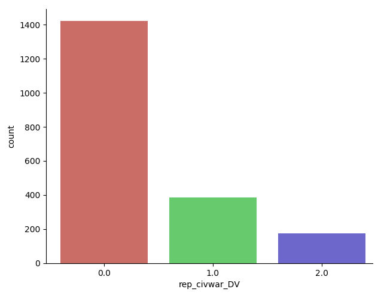

Tutorial for Estimating ZiOP Model
==================================

The zmiopc package contains functions to estimate "zero-inflated" ordered probit (ZiOP) models (ziop).

To illustrate its functionality, we use a dataset extracted from Besley and Persson (	`2009 <https://www.aeaweb.org/articles?id=10.1257/aer.99.2.292>`__). They use an Ordered Logit model to analyze the relationship between a number of economic and political covariates and the level of political violence. The outcome variable in our example is *'rep_civwar_DV'*. It measures the level of *Political Violence*, which is coded as follows:

+ 0: Peace

+ 1: Repression

+ 2: Civil War

The plot above shows the number of obervations (country-year) for each potential outcome of the outcome variable. We can first see that there is an excessive number of "0"- zero observations. But it is possible that two different types of zero observations account for the "zero-inflation" in the data (see Bagozzi et al. `2009 <https://journals.sagepub.com/doi/abs/10.1177/0022002713520530>`__ for further detail). The first type of zeroes may exist when countries do not experience any domestic conflict. The second type inlcudes those cases when dissidents are deterred, but violence is still a possibility.

Because of the two types of zero observations, the ZiOP model is more appropriate than the conventional ordered logit or ordered probit models.

Variables in the Outcome (Ordered Probit) equation:

- *'logGDPpc'*: (logged) GDP Per Capita

- *'parliament'*: Whether the legislature is a parliamentary system

- *'disaster'*: Weather shocks, the number of floods and heat waves (Emergency Disasters Database).

- *'major_oil'*: Oil exporter, 1 for country-years in which more than 10 percent of a country’s gross domestic product (GDP) was generated by oil exports, 0 otherwise.

- *'major_primary'*: Primary product exporter, 1 for country-years in which more than 10 percent of a country’s GDP was generated by primary product exports, 0 otherwise.

Variables in the Inflation (Split-probit) equation:

- *'logGDPpc'*: (logged) GDP Per Capita.

- *'parliament'*: Whether the legislature is a parliamentary system.

The following code shows how to estimate the ZiOP model in Python:

.. testcode::

  import numpy as np
  import pandas as pd
  import urllib
  #Import pandas and urllib to read data from url
  from  import zmiopc
  #Import data
  url='https://github.com/hknd23/zmiopc/raw/master/data/bp_exact_for_analysis.dta'
  data=pd.read_stata(url)

  # Specify list of variable names (strings) X,Y,Z:
  X = ['logGDPpc', 'parliament', 'disaster', 'major_oil', 'major_primary']
  Z = ['logGDPpc', 'parliament']
  Y = ['rep_civwar_DV']

  # Starting parameters for optimization:
  pstartziop=np.array( [-1.31, .32, 2.5, -.21,.2, -0.2, -0.4, 0.2,.9,-.4])

  # Model estimation:
  ziop_JCR= zmiopc.ziopmod(pstartziop, data, X, Y, Z,method='bfgs', weights= 1,offsetx= 0, offsetz=0)

  # See estimates:
  print(ziop_JCR.coefs)

:class:`zmiopc.ZiopModel` stores results from model estimation and other information.

Results from the model:

The following message will appear when the model finishes converging

.. testoutput::

  Warning: Desired error not necessarily achieved due to precision loss.
       Current function value: 1385.909054
       Iterations: 34
       Function evaluations: 529
       Gradient evaluations: 44

Use print(ziop_JCR.coefs) to see model results:

.. testoutput::

                      Coef        SE         2.5%      97.5%
  cut1              0.771855  0.352637     0.080686   1.463024
  cut2             -0.098204  0.046598    -0.189536  -0.006872
  Z int            18.781755  0.289231    18.214862  19.348647
  Z logGDPpc       -2.081926  0.025977    -2.132841  -2.031010
  Z parliament     -0.292586  0.251139    -0.784819   0.199647
  X logGDPpc        0.041251  0.048662    -0.054127   0.136629
  X parliament     -0.095081  0.133979    -0.357679   0.167517
  X disaster        0.264986  0.034355     0.197651   0.332321
  X major_oil       1.706935  0.299351     1.120208   2.293663
  X major_primary  -0.422205  0.263260    -0.938194   0.093785

:class:`zmiopc.ZiopModel` also stores information such as log-likelihood, AIC, and Variance-Covariance matrix

.. testcode::

  print(ziop_JCR.llik)
  print(ziop_JCR.AIC)
  print(ziop_JCR.vcov)

To extract predicted probabilities from the model:
:func:`zmiopc.ziopfit` returns :class:`zmiopc.FittedVals` containing fitted probablities.

.. testcode::

  fitttedziop = ziopc.ziopfit(ziop_JCR)
  print(fitttedziopc.responsefull)

.. testoutput::

  array([[0.96910461, 0.02038406, 0.01051134],
       [0.95572439, 0.01995972, 0.02431589],
       [0.97773287, 0.01467479, 0.00759234],
       ...,
       [0.97039298, 0.02020078, 0.00940624],
       [0.97957951, 0.0150263 , 0.00539419],
       [0.98114903, 0.01386849, 0.00498248]])

The Vuong Test with a v statistic can be performed to compare the performance of the ZiOP model versus the standard Ordered Probit (OP) model using :func:`zmiopc.vuong_opziop`.
The OP and ZiOP must have the same number of observations, and the OP must have the same number of covariates as ZiOP's OP stage. (see :doc:`op_tutorial` for details on fitting the OP model)

.. testcode::

  zmiopc.vuong_opziop(JCR_OP, ziop_JCR)

.. testoutput::

   -4.909399264831751

A v statistic where v < -1.96 favors the ZiOP model, -1.96 < v < 1.96 favors neither model, and v > 1.96 favors the OP model.
