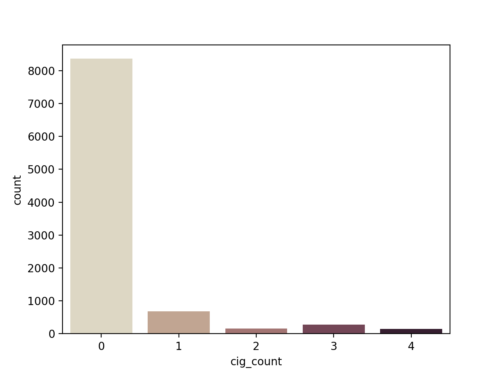

***************
zmiopc Package
***************

Tutorial to estimate the ZiOP, ZiOPC, and standard OP model using the zmiopc package.

Data Description
================

To illustrate the use of the ZiOP and ZiOPC functions, we use data from the National Youth Tobacco Survey (`2018 <https://www.cdc.gov/tobacco/data_statistics/surveys/nyts/index.htm>`__).
The authors use an Ordered Logit model to analyze the relationship between a number of economic and political covariates and the level of political violence.
The outcome variable in our example is *'cig_count'*. It measures the level of *Political Violence*, which is coded as follows:

+ 0: Peace

+ 1: Repression

+ 2: Civil War

    
The plot above illustrates the number of obervations (country-year) for each potential outcome of the outcome variable. It shows that there is an excessive number of "0" -zero- observations.
Yet, as Bagozzi et al. (`2009 <https://journals.sagepub.com/doi/abs/10.1177/0022002713520530>`__) suggest, it is possible that two different types of zero observations account for the "zero-inflation" in the data.  Specifically, the first type of zeroes may exist when countries do not experience any domestic conflict while the second type can inlcude those cases when dissidents are deterred, but violence is still a possibility.

Because of the two types of zero observations, estimating a "zero-infllated" ordered probit (ZiOP) model is more appropriate than conventional ordered logit or ordered probit models.

Variables in the Outcome (Ordered Probit) equation:

- *'logGDPpc'*: (logged) GDP Per Capita

- *'parliament'*: Whether the legislature is a parliamentary system

- *'disaster'*: Weather shocks, the number of floods and heat waves (Emergency Disasters Database).

- *'major_oil'*: Oil exporter, 1 for country-years in which more than 10 percent of a country’s gross domestic product (GDP) was generated by oil exports, 0 otherwise.

- *'major_primary'*: Primary product exporter, 1 for country-years in which more than 10 percent of a country’s GDP was generated by primary product exports, 0 otherwise.

Variables in the Inflation (Split-probit) equation:

- *'logGDPpc'*: (logged) GDP Per Capita.

- *'parliament'*: Whether the legislature is a parliamentary system.

To set up the zmiopc package and import data:

.. testcode::

  import numpy as np
  import pandas as pd
  import urllib
  #Import pandas and urllib to read data from url
  from zmiopc import zmiopc
  #Import data
  url='https://github.com/hknd23/zmiopc/raw/master/data/bp_exact_for_analysis.dta'
  data=pd.read_stata(url)

The ZiOP and ZiOPC models are estimated with this specification.

.. testcode::

  # Specify list of variable names (strings) X,Y,Z:
  X = ['logGDPpc', 'parliament', 'disaster', 'major_oil', 'major_primary']
  Z = ['logGDPpc', 'parliament']
  Y = ['rep_civwar_DV']

The list X specifies the variables in the Ordered Probit equation.
Z specifies the split-probit equation. Y is the dependent variable.

Estimating the ZiOP Model
=========================

The estimation of the model requires users to set up an array of starting parameters (one for each covariate).

:func:`zmiopc.iopmod` estimates the ZiOP model and returns :class:`zmiopc.IopModel`.

.. testcode::

  # Starting parameters for optimization:
  pstartziop=np.array( [-1.31, .32, 2.5, -.21,.2, -0.2, -0.4, 0.2,.9,-.4])

  # Model estimation:
  ziop_JCR= zmiopc.iopmod(pstartziop, data, X, Y, Z, method='bfgs', weights= 1,offsetx= 0, offsetz=0)

  # See estimates:
  print(ziop_JCR.coefs)

Results from the model:

The following message will appear when the model finishes converging:

.. testoutput::

  Warning: Desired error not necessarily achieved due to precision loss.
       Current function value: 1385.909054
       Iterations: 34
       Function evaluations: 529
       Gradient evaluations: 44

Object :class:`zmiopc.IopModel` stores model results and goodness-of-fit tests in its attributes 'coefs', 'AIC', 'llik', and 'vcov'.
Use print(ziop_JCR.coefs) to see model results:

.. testoutput::

                      Coef        SE         2.5%      97.5%
  cut1              0.771855  0.352637     0.080686   1.463024
  cut2             -0.098204  0.046598    -0.189536  -0.006872
  Z int            18.781755  0.289231    18.214862  19.348647
  Z logGDPpc       -2.081926  0.025977    -2.132841  -2.031010
  Z parliament     -0.292586  0.251139    -0.784819   0.199647
  X logGDPpc        0.041251  0.048662    -0.054127   0.136629
  X parliament     -0.095081  0.133979    -0.357679   0.167517
  X disaster        0.264986  0.034355     0.197651   0.332321
  X major_oil       1.706935  0.299351     1.120208   2.293663
  X major_primary  -0.422205  0.263260    -0.938194   0.093785

In addition to estimates, standard errors, and confidence intervals are shown in the results table. The Log-likelihood, AIC, and Variance-Covariance Matrix are also stored.  Users can obtain these diagnostic tests by using the following command:

.. testcode::

  print(ziop_JCR.llik)
  print(ziop_JCR.AIC)
  print(ziop_JCR.vcov)

.. testoutput::

  1385.9090536381054
  2791.818107276211
  [[ 1.24353127e-01  1.25663548e-03 -5.75548917e-02  1.70236103e-03
  5.05273309e-02  1.70531099e-02 -2.86418193e-02  2.58717572e-03
  -8.30490698e-03 -2.11871734e-03]
  ...
  [-2.11871734e-03  5.64634344e-04 -9.57288274e-03  3.62751905e-04
  8.65751652e-03 -3.86427924e-04  1.58932049e-03  2.96437285e-04
  -5.25452969e-02  6.93057415e-02]]

To extract predicted probabilities from the model:
:func:`zmiopc.iopfit` returns :class:`zmiopc.FittedVals` containing fitted probablities.

.. testcode::

  fitttedziop = ziopc.iopfit(ziop_JCR)
  print(fitttedziopc.responsefull)

.. testoutput::

  array([[0.96910461, 0.02038406, 0.01051134],
       [0.95572439, 0.01995972, 0.02431589],
       [0.97773287, 0.01467479, 0.00759234],
       ...,
       [0.97039298, 0.02020078, 0.00940624],
       [0.97957951, 0.0150263 , 0.00539419],
       [0.98114903, 0.01386849, 0.00498248]])

Estimating the ZiOPC Model
==========================

The package also includes functions to fit split-population (SP) " or zero-inflated" ordered probit models (ziopc) under the assumption that the two errors are correlated with each other (i.e. correlated errors).

The model also includes the estimate 'rho'. The ZiOPC model in this tutorial uses the same specification of the ZiOP model presented above.
One extra parameter - rho - is estimated in the ZiOPC model.

.. testcode::

    # Starting parameters for optimization, note the extra parameter for rho:
    pstart = np.array([-1.31, .32, 2.5, -.21, .2, -0.2, -0.4, 0.2, .9, -.4, .1])

    # Model estimation:
    ziopc_JCR = zmiopc.iopcmod(pstart, data, X, Y, Z, method='bfgs', weights=1, offsetx=0, offsetz=0)

Similar to ZiOP, the results are stored in the attributes of :class:`zmiopc.IopCModel`.

.. testoutput::

  Warning: Desired error not necessarily achieved due to precision loss.
        Current function value: 1374.171899
        Iterations: 44
        Function evaluations: 963
        Gradient evaluations: 74

Use print(ziopc_JCR.coefs) to see model results

.. testoutput::

                      Coef          SE         2.5%      97.5%
  cut1              2.762593  0.369820     2.037746   3.487439
  cut2             -0.214227  0.048677    -0.309634  -0.118820
  Z int            11.597619  0.407915    10.798106  12.397132
  Z logGDPpc       -1.279668  0.049340    -1.376374  -1.182961
  Z parliament     -0.370217  0.296634    -0.951619   0.211186
  X logGDPpc        0.331656  0.053253     0.227281   0.436032
  X parliament      0.312728  0.292929    -0.261414   0.886869
  X disaster        0.197342  0.033247     0.132179   0.262506
  X major_oil       1.182631  0.373049     0.451455   1.913806
  X major_primary  -0.236625  0.209179    -0.646615   0.173365
  rho              -0.889492  0.040109    -0.968106  -0.810878

To extract information such as log-likelihood, AIC, and Variance-Covariance matrix:

.. testcode::

  print(ziopc_JCR.llik)
  print(ziopc_JCR.AIC)
  print(ziopc_JCR.vcov)

.. testoutput::

  1374.1718991713317
  2770.3437983426634
  [[ 1.36766528e-01 -1.50391291e-03 -2.25732999e-02 -1.42852474e-03
    4.18278908e-03  1.95389976e-02  3.02647268e-03 -1.09348495e-03
    3.22896421e-02 -9.24547286e-03 -3.83238156e-03]
    ...
  [-3.83238156e-03  8.85000862e-04  3.45224424e-03 -4.08558670e-04
    -8.30687503e-04 -5.47455159e-04 -1.33691918e-03  3.12422823e-04
    -3.71512027e-03 -7.29939034e-04  1.60875279e-03]]

To extract predicted probabilities from the model:
:func:`zmiopc.iopcfit` returns :class:`zmiopc.FittedVals` containing fitted probablities.

.. testcode::

  fitttedziopc = zmiopc.iopcfit(ziopc_JCR)
  print(fitttedziopc.responsefull)

.. testoutput::

  array([[9.68868303e-01, 3.01063427e-02, 1.02535403e-03],
      [9.07563628e-01, 7.88301952e-02, 1.36061769e-02],
      [9.76972004e-01, 2.23954809e-02, 6.32514846e-04],
      ...,
      [9.66496738e-01, 3.19780772e-02, 1.52518446e-03],
      [9.82515374e-01, 1.70648356e-02, 4.19790597e-04],
      [9.83907141e-01, 1.57240833e-02, 3.68775369e-04]])

Estimating the OP Model
=======================

The package also includes a fucntion that estimates a standard Ordered Probit (OP) model.
The OP model does not account for the "zero inflation", so it does not have a split-probit stage.

.. testcode::

  # Specify list of variable names (strings) X,Y:
  X = ['logGDPpc', 'parliament', 'disaster', 'major_oil', 'major_primary']
  Y = ['rep_civwar_DV']

  # Starting parameters for optimization:
  pstartop = np.array([-1, 0.3, -0.2, -0.5, 0.2, .9, -.4])

  # Model estimation:
  JCR_OP = zmiopc.opmod(pstartop, data, X, Y, method='bfgs', weights=1, offsetx=0)

The following message will appear when the model finishes converging:

.. testoutput::

  Warning: Desired error not necessarily achieved due to precision loss.
      Current function value: 1385.909054
      Iterations: 34
      Function evaluations: 529
      Gradient evaluations: 44

:class:`zmiopc.OpModel` stores results from model estimation and other information in its attributes.
Use print(JCR_OP.coefs) to see model results:

.. testoutput::

                      Coef        SE    tscore       2.5%     97.5%
  cut1            -1.072649  0.268849 -3.989777  -1.599594 -0.545704
  cut2            -0.171055  0.045801 -3.734712  -0.260826 -0.081284
  X logGDPpc      -0.212266  0.035124 -6.043404  -0.281108 -0.143424
  X parliament    -0.538013  0.099811 -5.390330  -0.733642 -0.342384
  X disaster       0.220324  0.026143  8.427678   0.169084  0.271564
  X major_oil      0.907116  0.358585  2.529714   0.204290  1.609942
  X major_primary -0.426577  0.245248 -1.739370  -0.907264  0.054109

Log-likelihood, AIC, and Variance-Covariance matrix can be extracted with:

.. testcode::

  print(JCR_OP.llik)
  print(JCR_OP.AIC)
  print(JCR_OP.vcov)

.. testoutput::

  1432.2413576717308
  2878.4827153434617
  [[ 7.22800339e-02 -7.80059925e-04  9.35795290e-03 -1.10683026e-02
    -6.57753182e-05 -4.83722782e-03  3.86783131e-03]
    ...
  [ 3.86783131e-03 -2.83366327e-04  3.16586107e-04  1.71164606e-03
    2.83414563e-04 -5.98088317e-02  6.01466912e-02]]

The Vuong Test
==============

Harris and Zhao (`2007 <https://doi.org/10.1016/j.jeconom.2007.01.002>`__) suggest that a variant of the Vuong (`1989 <https://www.jstor.org/stable/1912557>`__) Test (with a v statistic) can be used to compare the performance of the ZiOP versus the standard Ordered Probit (OP) model using :func:`zmiopc.vuong_opiop`.
The Vuong test denotes m\ :sub:`i`\ as the natural logarithm of the ratio of the predicted probablity that i\ :sub:`j`\ of the simpler OP model (in the numerator) and the more general (ZiOP/ZiOPC) model (in the denominaor) and evaluates m\ :sub:`i`\
via a bidirectional test statistic of:

.. math::

   v = \frac{\sqrt{N}(\frac{1}{N}\sum_{i}^{N}m_{i})}{\sqrt{\frac{1}{N}\sum_{i}^{N}(m_{i}-\bar{m})^{2}}}

where v < -1.96 favors the more general (ZiOP/ZiOPC) model, -1.96 < v < 1.96 lends no support to either model, and v > 1.96 supports the simpler (OP) model.

The OP and ZiOP models must have the same number of observations, and the OP must have the same number of covariates as ZiOP's OP stage.

.. testcode::

  zmiopc.vuong_opiop(JCR_OP, ziop_JCR)

.. testoutput::

   -4.909399264831751

The Vuong test can also be implemented to compare the ZiOPC model and the OP model:

.. testcode::

  zmiopc.vuong_opiopc(JCR_OP, ziopc_JCR)

.. testoutput::

   -5.424415009176218

A v statistic where v < -1.96 favors the ZiOP model, -1.96 < v < 1.96 favors neither model, and v > 1.96 favors the OP model.

Split Equtation Predicted Probablities
======================================

:func:`zmiopc.split_effects` simulates data from ZiOP/ZiOPC model results and computes changes in predicted probabilities when the value of a variable changes.
This allows us to illustrate how the changes in the split-probit covariates affect the probablilities of being in one population versus another.

.. testcode::

  ziopparl = zmiopc.split_effects(ziop_JCR, 2)
  print(ziopparl)

.. testoutput::

          Z parliament 0  Z parliament 1
  0           0.990405        0.958839
  1           0.992943        0.965678
  2           0.982540        0.984868
  3           0.974472        0.961386
  4           0.973550        0.943025
                ...             ...
  9995        0.981573        0.965662
  9996        0.990899        0.971891
  9997        0.988671        0.971410
  9998        0.995775        0.957148
  9999        0.984480        0.956248
  [10000 rows x 2 columns]

The returned dataframe contains predicted probabilities when 'parliament' equals 0, and when 'parliament' equals 1.
The box plots below illustrate the change in predicted probablities using the values from the 'ziopparl' dataframe.

.. image:: ../graphics/ZiOP_Parliament.png
