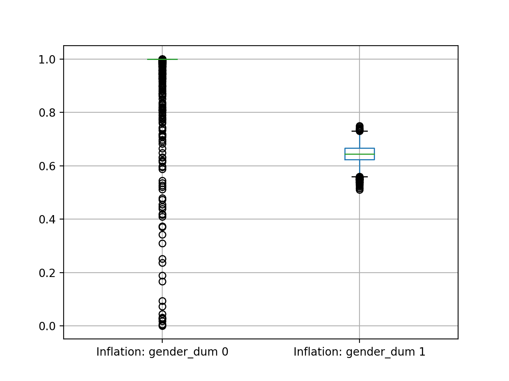
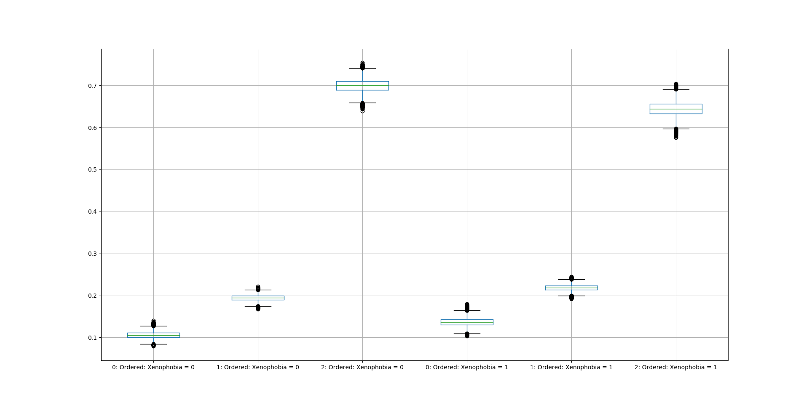

***************
IDCeMPy Package
***************

Description
===========
`IDCeMPy` is a Python package that provides functions to fit and assess the performance of the following distinct
sets of “inflated” discrete choice models.

* Fit the Zero-Inflated Ordered Probit (ZIOP) model without and with correlated errors (ZIOPC model) to evaluate zero-inflated ordered choice outcomes that results from a dual data generating
process (d.g.p.).

* Fit the Middle-Inflated Ordered Probit (MIOP) model without and with correlated errors (MIOPC) to account for the inflated middle-category in ordered choice measures that relates to a dual d.g.p.

* Fit Generalized Inflated Multinomial Logit (GIMNL) models that account for the preponderant and heterogeneous share of observations in the baseline or any lower category in unordered polytomous choice outcomes.

* Compute AIC and Log-likelihood statistics and the Vuong Test statistic to assess the performance of each inflated discrete choice model in the package.

`IDCeMPy` uses Newton numerical optimization methods to estimate the models listed above via Maximum Likelihood Estimation (MLE).

When should you use `IDCeMPy`?
==============================

An excessive (“inflated”) share of observations—stemming from two distinct d.g.p’s—fall into a single choice category in many ordered and unordered polytomous outcome variables. Standard Ordered Probit and Multinomial Logit models cannot account for such category inflation which leads to biased inferences. Examples include,

* The inflated zero-category of "no smoking" in ordered measures of self-reported smoking behavior is generated from nonsmokers who never smoke cigarettes and those who smoked previously but temporarily stopped smoking because of high cigarette prices.

* The inflated "indifference" middle-category in ordered measures of immigration attitudes includes respondents truly indifferent to immigration and those that choose indifference for social desirability reasons.

* The inflated baseline or other lower outcome categories of unordered polytomous outcome measures of vote choice include nonvoters who temporarily abstain from voting and routine nonvoters who always abstain.

`IDCeMPy` includes the ZIOP(C) models for evaluating zero-inflated ordered choice outcomes that results from a dual d.g.p, the MIOP(C) models that address inflated middle-category ordered outcome measures arising from distinct d.g.p’s, and GIMNL models that account for inflated baseline or other categories for unordered polytomous outcomes.

Each inflated discrete choice model in this package addresses category inflation in one’s discrete outcome—unordered or unordered polytomous—of interest by jointly estimating a binary split-stage equation and an ordered or multinomial discrete choice outcome equation.

How does it work?
=================

Installation
=============
The package can be installed in two different ways.

1. From `PyPi <https://pypi.org/>`__:

.. testcode::
  # Import the package

  pip install idcempy

2. From its `GitHub Repository <https://github.com/hknd23/idcempy/>`__:

.. testcode::
  # Import the package

  git clone https://github.com/hknd23/idcempy.git
  cd idcempy
  python setup.py install

Examples
========

Zero-inflated Ordered Probit (ZiOP) Model without Correlated Errors
--------------------------------------------------------------------
The `iopmod` function estimates regression objects for "zero-inflated" and "middle-inflated" ordered probit models without correlated errors.  Below you will find instructions to estimate a ZiOP model.  The estimation of MiOP models is also illustrated.

First, we import the required libraries, set up the package and import the dataset:

.. testcode::
  # Import the necessary libraries and package

  import numpy as np
  import pandas as pd
  import urllib
  from zmiopc import zmiopc

  # Import the "Youth Tobacco Consumption" dataset.

  url='https://github.com/hknd23/zmiopc/blob/main/data/tobacco_cons.csv'
  data=pd.read_stata(url)

Our data is now a `pandas` DataFrame, and we can proceed to estimate the ZiOP model as follows.

.. testcode::

  # First, you should define a list of variable names of X, Z, and Y.
  # X = The covariates of the ordered probit stage.
  # Z = The covariates of the inflation (split-population) stage.
  # Y = The ordinal outcome variable.

  X = ['age', 'grade', 'gender_dum']
  Z = ['gender_dum']
  Y = ['cig_count']

The package sets a default start value of .01 for all parameters.  Users can modify it by creating an array with their desired values, define such array as `pstart` and add it to as an argument in the model function.  

:func:`zmiopc.iopmod` estimates the ZiOP model and returns :class:`zmiopc.IopModel`.

.. testcode::

   # Model estimation:
  ziop_tob= zmiopc.iopmod('ziop', data, X, Y, Z, method='bfgs', weights= 1,offsetx= 0, offsetz=0)

  # See estimates:
  print(ziop_tob.coefs)

Results from the model:

The following message will appear when the model has converged:

.. testoutput::

         Warning: Desired error not necessarily achieved due to precision loss.
         Current function value: 5060.160903
         Iterations: 79
         Function evaluations: 1000
         Gradient evaluations: 100

Object :class:`zmiopc.IopModel` stores model results and goodness-of-fit tests in its attributes 'coefs', 'AIC', 'llik', and 'vcov'.

Use the following line of code to see the estimates of coefficients:

.. testcode::

   print(ziop_tob.coefs)

.. testoutput::

                            Coef        SE      tscore        p           2.5%      97.5%
   cut1                   1.693797  0.054383  31.145912  0.000000e+00   1.587207   1.800387
   cut2                  -0.757830  0.032290 -23.469359  0.000000e+00  -0.821119  -0.694542
   cut3                  -1.804483  0.071237 -25.330846  0.000000e+00  -1.944107  -1.664860
   cut4                  -0.691907  0.052484 -13.183210  0.000000e+00  -0.794775  -0.589038
   Inflation: int         4.161455  3.864721   1.076780  2.815784e-01  -3.413398  11.736309
   Inflation: gender_dum -3.462848  3.857160  -0.897772  3.693074e-01 -11.022881   4.097185
   Ordered: age          -0.029139  0.013290  -2.192508  2.834282e-02  -0.055187  -0.003090
   Ordered: grade         0.177897  0.012133  14.661952  0.000000e+00   0.154116   0.201678
   Ordered: gender_dum    0.206509  0.034914   5.914823  3.322323e-09   0.138078   0.274940

In addition to coefficient estimates, the table also presents the standard errors, and confidence intervals.

The model object also stores three (3) different diagnostic tests: (1) Log-likelihood, (2) Akaike Information Criteria (AIC), and Variance-Covariance Matrix (VCM).  You can obtain them via the following commands:

.. testcode::

  print(ziop_tob.llik)
  print(ziop_tob.AIC)
  print(ziop_tob.vcov)

An example for the AIC:

.. testcode::

  print(ziop_tob.AIC)

.. testoutput::

  10138.321806674261

You can also extract predicted probabilities from the model:
:func:`zmiopc.iopfit` returns :class:`zmiopc.FittedVals` containing fitted probablities.

.. testcode::

  fitttedziop = ziopc.iopfit(ziop_tob)
  print(fitttedziopc.responsefull)

.. testoutput::

  array[[0.8822262  0.06879832 0.01455244 0.0242539  0.01016914]
 [0.84619828 0.08041296 0.01916279 0.03549797 0.01872801]
 [0.93105632 0.04349743 0.00831396 0.0127043  0.004428  ]
 ...
 [0.73347708 0.1291157  0.03295816 0.06500889 0.03944016]
 [0.87603805 0.06808193 0.01543795 0.02735256 0.01308951]
 [0.82681957 0.08778215 0.02153509 0.04095753 0.02290566]]

Zero-inflated Ordered Probit (ZiOPC) with Correlated Errors
-----------------------------------------------------------
The package also includes the function `iopcmod` which fits "zero-inflated" ordered probit models (ZiOPC) and "middle-inflated" ordered probit models (MiOP) under the assumption that the two errors are correlated with each other (i.e. correlated errors). Both models include the estimate of'rho'. The models in this section use the same specification as the models estimated without correlated errors presented above.

**1. Estimate the ZiOPC model**
.. testcode::

    ziopc_tob = zmiopc.iopcmod('ziopc', data, X, Y, Z, method='bfgs', weights=1, offsetx=0, offsetz=0)

Similar to ZiOP, the results are stored in the attributes of :class:`zmiopc.IopCModel`.

.. testoutput::

         Current function value: 5060.051910
         Iterations: 119
         Function evaluations: 1562
         Gradient evaluations: 142

**2. Print the results**

.. testcode::

    print(ziopc_tob.coefs)

.. testoutput::

                            Coef        SE     tscore             p       2.5%      97.5%
   cut1                   1.696160  0.044726  37.923584  0.000000e+00   1.608497   1.783822
   cut2                  -0.758095  0.033462 -22.655678  0.000000e+00  -0.823679  -0.692510
   cut3                  -1.812077  0.060133 -30.134441  0.000000e+00  -1.929938  -1.694217
   cut4                  -0.705836  0.041432 -17.036110  0.000000e+00  -0.787043  -0.624630
   Inflation: int         9.538072  3.470689   2.748178  5.992748e-03   2.735521  16.340623
   Inflation: gender_dum -9.165963  3.420056  -2.680062  7.360844e-03 -15.869273  -2.462654
   Ordered: age          -0.028606  0.008883  -3.220369  1.280255e-03  -0.046016  -0.011196
   Ordered: grade         0.177541  0.010165  17.465452  0.000000e+00   0.157617   0.197465
   Ordered: gender_dum    0.602136  0.053084  11.343020  0.000000e+00   0.498091   0.706182
   rho                   -0.415770  0.074105  -5.610526  2.017123e-08  -0.561017  -0.270524

To print the estimates of the log-likelihood, AIC, and Variance-Covariance matrix, you should type:

.. testcode::

  print(ziopc_tob.llik)
  print(ziopc_tob.AIC)
  print(ziopc_tob.vcov)

The AIC of the ziopc_tob model, for example, is:

.. testoutput::

  10140.103819465658

**2.1 Obtain predicted probabilities from the ziopc_tob model:**
:func:`zmiopc.iopcfit` returns :class:`zmiopc.FittedVals` containing fitted probablities.

.. testcode::

  fitttedziopc = zmiopc.iopcfit(ziopc_tob)
  print(fitttedziopc.responsefull)

.. testoutput::

  array[[0.88223509 0.06878162 0.01445941 0.0241296  0.01039428]
 [0.84550989 0.08074461 0.01940226 0.03589458 0.01844865]
 [0.93110954 0.04346074 0.00825639 0.01264189 0.00453143]
 ...
 [0.73401588 0.12891071 0.03267436 0.06438928 0.04000977]
 [0.87523652 0.06888286 0.01564958 0.0275354  0.01269564]
 [0.82678185 0.0875059  0.02171135 0.04135142 0.02264948]]

Middle-inflated Ordered Probit without Correlated Errors (MiOP)
---------------------------------------------------------------
We begin by importing the Elgun and Tilam (`2007 <https://journals.sagepub.com/doi/10.1177/1065912907305684>`_) data on European Integration described above.  Recall that our outcome variable is "inflated" in the middle category.

.. testcode::

    url = 'https://github.com/hknd23/zmiopc/blob/main/data/'
    data2 = pd_read.stata(url)

We then define the lists with the names of the variables used in the model

.. testcode::

  X = ['Xenophobia', 'discuss_politics']
  Z = ['discuss_politics', EU_Know_ob]
  Y = ['EU_support_ET']

X is the list of variables in the Ordered Probit equation (second-stage).
Z is the list of variables in the split-probit equation (first-stage).
Y is the outcome variable.

:func:`zmiopc.iopmod` estimates the MiOP model and returns :class:`zmiopc.IopModel`.

.. testcode::

  # Model estimation:
  miop_EU = zmiopc.iopmod('miop', data, X, Y, Z, method='bfgs', weights= 1,offsetx= 0, offsetz=0)

.. testoutput::

         Warning: Desired error not necessarily achieved due to precision loss.
         Current function value: 10857.695490
         Iterations: 37
         Function evaluations: 488
         Gradient evaluations: 61  # See estimates:

.. testcode::

         print(miop_EU.coefs)

.. testoutput::

                                 Coef        SE       tscore         p         2.5%     97.5%
   cut1                        -1.159621  0.049373 -23.487133  0.000000e+00 -1.256392 -1.062851
   cut2                        -0.352743  0.093084  -3.789492  1.509555e-04 -0.535188 -0.170297
   Inflation: int              -0.236710  0.079449  -2.979386  2.888270e-03 -0.392431 -0.080989
   Inflation: discuss_politics  0.190595  0.035918   5.306454  1.117784e-07  0.120197  0.260993
   Inflation: EU_Know_obj       0.199574  0.020308   9.827158  0.000000e+00  0.159770  0.239379
   Ordered: Xenophobia         -0.663551  0.044657 -14.858898  0.000000e+00 -0.751079 -0.576024
   Ordered: discuss_politics    0.023784  0.029365   0.809964  4.179609e-01 -0.033770  0.081339

In addition to coefficient estimates, the table also presents the standard errors, and confidence intervals.

The model object also stores three (3) different diagnostic tests: (1) Log-likelihood, (2) Akaike Information Criteria (AIC), and Variance-Covariance Matrix (VCM).  You can obtain them via the following commands:

.. testcode::

  print(miop_EU.llik)
  print(miop_EU.AIC)
  print(miop_EU.vcov)

An example for the AIC:

.. testcode::

   print(miop_EU.AIC)

.. testoutput::

   21729.390980849777

Please see **Section 2.1** for instructions on how to calculate and print the fitted values.

 **3. Estimation of MiOPC**

This example uses the the Elgun and Tilam (`2007 <https://journals.sagepub.com/doi/10.1177/1065912907305684>`_) data on European Integration described above. Recall that our outcome variable is "inflated" in the middle category.

.. testcode::

    url = 'https://github.com/hknd23/zmiopc/blob/main/data/'
    data2 = pd_read.stata(url)

We then define the lists with the names of the variables used in the model

.. testcode::

  X = ['Xenophobia', 'discuss_politics']
  Z = ['discuss_politics', EU_Know_ob]
  Y = ['EU_support_ET']

X is the list of variables in the Ordered Probit equation (second-stage).
Z is the list of variables in the split-probit equation (first-stage).
Y is the outcome variable.

:func:`zmiopc.iopmod` estimates the MiOP model and returns :class:`zmiopc.IopModel`.

.. testcode::

  # Model estimation:
  miopc_EU = zmiopc.iopcmod('miopc', pstartziop, data, X, Y, Z, method='bfgs', weights= 1,offsetx= 0, offsetz=0)

.. testcode::

         print(miopc_EU.coefs)

.. testoutput::

                                 Coef  SE     tscore  p     2.5%  97.5%
   cut1                        -1.370 0.044 -30.948 0.000 -1.456 -1.283
   cut2                        -0.322 0.103  -3.123 0.002 -0.524 -0.120
   Inflation: int              -0.129 0.021  -6.188 0.000 -0.170 -0.088
   Inflation: discuss_politics  0.192 0.026   7.459 0.000  0.142  0.243
   Inflation: EU_Know_obj       0.194 0.027   7.154 0.000  0.141  0.248
   Ordered: Xenophobia         -0.591 0.045 -13.136 0.000 -0.679 -0.502
   Ordered: discuss_politics   -0.029 0.021  -1.398 0.162 -0.070  0.012
   rho                         -0.707 0.106  -6.694 0.000 -0.914 -0.500

In addition to coefficient estimates, the table also presents the standard errors, and confidence intervals.

The model object also stores three (3) different diagnostic tests: (1) Log-likelihood, (2) Akaike Information Criteria (AIC), and Variance-Covariance Matrix (VCM).  You can obtain them via the following commands:

.. testcode::

  print(miop_EU.llik)
  print(miop_EU.AIC)
  print(miop_EU.vcov)

Above you can read the instructions on how to calculate and print the fitted values.

Estimating the OP Model
=======================

The package also includes a fucntion that estimates a standard Ordered Probit (OP) model.
The OP model does not account for the "zero inflation", so it does not have a split-probit stage.

.. testcode::

     # Define a list of variable names (strings) X,Y,Z:
     X = ['age', 'grade', 'gender_dum']
     Y = ['cig_count']

X is the list of variables in the Ordered Probit equation.
Y is the outcome variable.

.. testcode::

  # Starting parameters for optimization:
  pstartop = np.array([.01, .01, .01, .01, .01, .01, .01])

  # Model estimation:
  op_tob = zmiopc.opmod(pstartop, data, X, Y, method='bfgs', weights=1, offsetx=0)

  # See estimates:
  print(ziop_tob.coefs)

Results from the model:

The following message will appear when the model has converged:

.. testoutput::

         Warning: Desired error not necessarily achieved due to precision loss.
         Current function value: 4411.710049
         Iterations: 10
         Function evaluations: 976
         Gradient evaluations: 121

:class:`zmiopc.OpModel` stores results from model estimation and other information in its attributes.
The following line of code to see the estimates of coefficients:

.. testcode::

   print(op_tob.coefs)

.. testoutput::

                Coef        SE     tscore         p      2.5%     97.5%
   cut1        1.696175  0.047320  35.844532  0.000000  1.603427  1.788922
   cut2       -0.705037  0.031650 -22.276182  0.000000 -0.767071 -0.643004
   cut3       -2.304405  0.121410 -18.980329  0.000000 -2.542369 -2.066441
   cut4        2.197381  0.235338   9.337141  0.000000  1.736119  2.658643
   age        -0.070615  0.007581  -9.314701  0.000000 -0.085474 -0.055756
   grade       0.233741  0.010336  22.614440  0.000000  0.213483  0.254000
   gender_dum  0.020245  0.032263   0.627501  0.530331 -0.042991  0.083482

Log-likelihood, AIC, and Variance-Covariance matrix can be extracted with:

.. testcode::

  print(op_tob.llik)
  print(op_tob.AIC)
  print(op_tob.vcov)

Similarly, the OP model with the EU data can also be fitted with the following:

.. testoutput::

  url = 'https://github.com/hknd23/zmiopc/blob/main/data/'
  data2 = pd_read.stata(url)
  X = ['Xenophobia', 'discuss_politics']
  Y = ['EU_support_ET']

  op_EU = zmiopc.opmod(data2, X, Y)

The OP model also stores information on Log-likelihood, AIC, and and Variance-Covariance matrix.

.. testcode::

  print(op_EU.llik)
  print(op_EU.AIC)
  print(op_EU.vcov)

The Vuong Test
==============

Harris and Zhao (`2007 <https://doi.org/10.1016/j.jeconom.2007.01.002>`__) suggest that a variant of the Vuong (`1989 <https://www.jstor.org/stable/1912557>`__) Test (with a v statistic) can be used to compare the performance of the ZiOP versus the standard Ordered Probit (OP) model using :func:`zmiopc.vuong_opiop`.
The Vuong test denotes m\ :sub:`i`\ as the natural logarithm of the ratio of the predicted probablity that i\ :sub:`j`\ of the simpler OP model (in the numerator) and the more general (ZiOP/ZiOPC) model (in the denominaor) and evaluates m\ :sub:`i`\
via a bidirectional test statistic of:

.. math::

    v = \frac{\sqrt{N}(\frac{1}{N}\sum_{i}^{N}m_{i})}{\sqrt{\frac{1}{N}\sum_{i}^{N}(m_{i}-\bar{m})^{2}}}

where v < -1.96 favors the more general (ZiOP/ZiOPC) model, -1.96 < v < 1.96 lends no support to either model, and v > 1.96 supports the simpler (OP) model.

The OP and ZiOP models must have the same number of observations, and the OP must have the same number of covariates as ZiOP's OP stage. The statistic reveals that the OP model is preferred over the ZiOP model.

.. testcode::

  zmiopc.vuong_opiop(op_tob, ziop_tob)

.. testoutput::

   6.624742132792222

The Vuong test can also be implemented to compare the ZiOPC, MiOP and MiOPC models and the OP model. For the case of the MiOP model, the test statistic favors the MiOP model.

.. testcode::

  zmiopc.vuong_opiop(op_EU, miop_EU)

.. testoutput::

   -9.638360843003559

Split Equtation Predicted Probablities
======================================

:func:`zmiopc.split_effects` simulates data from ZiOP/ZiOPC and MiOP/MiOPC model results and computes changes in predicted probabilities when the value of a variable changes.
This allows you to illustrate how the changes in the split-probit covariates affect the probablilities of being in one population versus another. The example below illustrates the marginal effects of the variable 'gender_dum' on the outcome variable in the ZiOPC model estimated in ths documentation.

.. testcode::

    ziopcgender = idcempy.split_effects(ziopc_tob, 1, nsims = 10000)

The returned dataframe contains predicted probabilities when 'gender_dum' equals 0, and when 'gender_dum' equals 1.
The box plots below illustrate the change in predicted probablities using the values from the 'ziopparl' dataframe.

.. testcode::

     ziopcgender.plot.box(grid='False')

Outcome Equation Predicted Probabilities
========================================

:func:: `zmiopc.ordered_effects` calculates the change in predicted probabilities of the outcome variable when the value of a covarariate changes. The box plots below display the change in predicted probabilities of the outcome variable in the MiOPC model estimated above when Xenophobia increases one standard deviation from its mean value.

.. testcode::

    xeno = zmiopc.ordered_effects(miopc_EU, 2, nsims = 10000)
    xeno.plot.box(grid='False')

GiMNL Model
===========

The IDCeMPy package also includes a function that estimates General "inflated" Multinomial Logit models (GiMNL).  GiMNL models minimize issues present when unordered polytomous outcome variables have an excessive share and heterogeneous pool of observations in the lower category.  The application below uses data from Campbell and Monson (`2008 <https://academic.oup.com/poq/article-abstract/72/3/399/1836972>`__) who use 'vote choice' as their outcome variable.  The 0,1,2 unordered-polytomous Presidential 'vote choice' doutcome variable in their data includes the following options: abstained (their MNL baseline category), Bush, or Kerry. In this case, the baseline category is inflated as it includes non-voters who abstain from voting in an election owing to temporary factors and “routine” non-voters who are consistently disengaged from the political process.  Faling to account for such inflation could lead to inaccurate inferences.

The covariates used to estimate the GiMNL model are:

- educ: Highest level of education completed.
- agegroup2: Indicator of age cohort.
- party7: Party identification.

To estimate the GiMNL model, we first import the library and the dataset introduced above.

.. testcode::

   from idcempy import gimnl
   url= 'https://github.com/hknd23/zmiopc/raw/main/data/replicationdata.dta'
   data= pd.read_stata(url)

We the define the list of covariates in the split-stage (z), the second-stage (x) and the outcome variable (y).

.. testcode::

   x = ['educ', 'party7', 'agegroup2']
   z = ['educ', 'agegroup2']
   y = ['vote_turn']

Users can employ the argument `inflatecat` to specify any unordered category as the inflated category (dictated by the distribution) in their unordered-polytomous outcome measure. If a higher category (say 1) is inflated in a 0,1,2 unordered outcome measure, then users can specify inflatecat as follows
.. testcode::

   order = [0, 1, 2]
   inflatecat = "baseline"

Further, employing the argument `reference`, users can select which category of the unordered outcome variable is the baseline ("reference") category by placing it first. Since the baseline ("0") category in the Presidential vote choice outcome measure is inflated, the following code fits the BIMNL Model.

.. testcode::

   gimnl_2004vote = gimnl.gimnlmod(data, x, y, z, order, inflatecat)

The following line of code prints the coefficients of the covariates.

.. testcode::

   print(gimnl_2004vote.coefs)

.. testoutput::

                          Coef   SE    tscore   p    2.5%   97.5%
   Inflation: int       -4.935 2.777  -1.777 0.076 -10.379  0.508
   Inflation: educ       1.886 0.293   6.441 0.000   1.312  2.460
   Inflation: agegroup2  1.295 0.768   1.685 0.092  -0.211  2.800
   1: int               -4.180 1.636  -2.556 0.011  -7.387 -0.974
   1: educ               0.334 0.185   1.803 0.071  -0.029  0.697
   1: party7             0.454 0.057   7.994 0.000   0.343  0.566
   1: agegroup2          0.954 0.248   3.842 0.000   0.467  1.441
   2: int                0.900 1.564   0.576 0.565  -2.166  3.966
   2: educ               0.157 0.203   0.772 0.440  -0.241  0.554
   2: party7            -0.577 0.058  -9.928 0.000  -0.691 -0.463
   2: agegroup2          0.916 0.235   3.905 0.000   0.456  1.376

The results from the BIMNL model for this application are stored in a class (gimnlModel) with the following attributes:

- coefs: Model coefficients and standard errors
- llik: Log-likelihood
- AIC: Akaike information criterion
- vcov: Variance-covariance matrix

The AIC, for exmaple is given by,

.. testcode::
    print(gimnl_2004vote.AIC)

.. testoutput::
    1656.8324085039708

Using the function :py:func:`gimnl.mnlmod`, users can fit a standard Multinomial Logit Model (MNL) by specifying the list of **X**, **Y**, and baseline (using `reference`).

.. testcode::

   mnl_2004vote = gimnl.mnlmod(data, x, y, z, order)
   print(mnl_2004vote.coefs)

.. testoutput::

  Coef    SE  tscore     p   2.5%  97.5%
  1: int       -4.914 0.164 -29.980 0.000 -5.235 -4.593
  1: educ       0.455 0.043  10.542 0.000  0.371  0.540
  1: party7     0.462 0.083   5.571 0.000  0.300  0.625
  1: agegroup2  0.951 0.029  32.769 0.000  0.894  1.008
  2: int        0.172 0.082   2.092 0.036  0.011  0.334
  2: educ       0.282 0.031   9.011 0.000  0.221  0.343
  2: party7    -0.567 0.085  -6.641 0.000 -0.734 -0.399
  2: agegroup2  0.899 0.138   6.514 0.000  0.629  1.170

Similar to the GiMNL model, the AIC for the MNL model can also be given by:

.. testcode::
    print(mnl_2004vote.AIC)

.. testoutput::
    1657.192925769978
